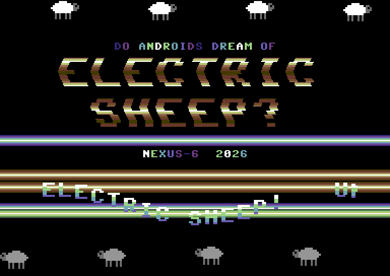
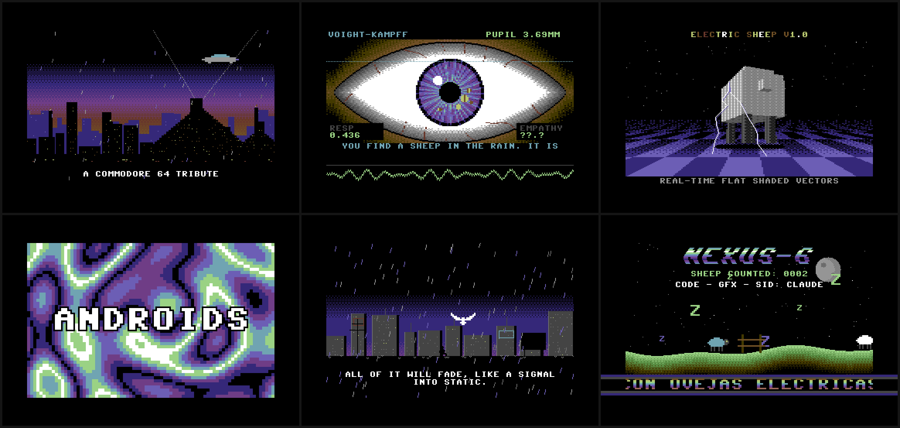

🇪🇸 <a href="README.md">Español</a> · 🇬🇧 <strong>English</strong>

# ELECTRIC SHEEP · a Commodore 64 tribute demo

> *Do Androids Dream of Electric Sheep?*

**▶ Watch it (and, above all, listen to it) here: https://pfelipm.github.io/electric-sheep/**

A multi-part demo in the spirit of the C64 demoscene, inspired by Philip K. Dick's novel and *Blade Runner*, with an original SID soundtrack that tries to bring the soul of Vangelis to a 1982 sound chip. Everything is made with **HTML, JavaScript and CSS, with no libraries at all**.

The voice and the Voight-Kampff test are in English; the start screen and the scrollers are in Spanish, the native language of its creator.

## The parts

| # | Part | Effects |
|---|---|---|
| 0 | Boot | BASIC V2 screen, `LOAD`, *PRESS PLAY ON TAPE* and tape-loading stripes in the border |
| 1 | Los Angeles, November 2019 | Parallax city, pyramids, flare bursts synced to the timpani, spinners, rain |
| 2 | Title | Raster bars in the border, raster-colored wobbling logo, DYCP scroller, sprites in the open borders |
| 3 | Voight-Kampff test | Procedural eye with a pupil that pulses to the music, synthesized voice, oscilloscope showing the real SID output |
| 4 | "Amiga" effects | Filled-vector 3D sheep with lightning, plasma, rotozoomer |
| 5 | Tears in rain | Monologue, lightning and the dove |
| 6 | Finale | Sheep jumping the fence (count them!), Zzz and a greetings scroller, looping |

## Controls

| Key | Action |
|---|---|
| `SPACE` | Skip to the next part |
| `R` | "Vangelis" reverb / pure SID |
| `V` | SAM voice (4-bit SID) / browser voice |
| `C` | CRT effect on/off |
| `F` | Fullscreen |
| `M` | Mute |

You can jump straight to a part with `?part=N` (0-5), e.g. `?part=2`.

## Under the hood

- **Virtual SID** ([js/sid.js](js/sid.js)): two chips (6 voices) emulated in an `AudioWorklet`. Each has a 24-bit phase accumulator, triangle, sawtooth, pulse with PWM, 23-bit LFSR noise, combined waveforms, ring mod, hard sync, ADSR with the chip's exponential curve, and a resonant multimode filter shared per chip. On top runs a 50 Hz tracker-style player with wavetables, chord arpeggios, vibrato, portamento and hard restart.
- **Soundtrack** ([js/song.js](js/song.js)): an original composition written in a tiny tracker language (`d5/8 ^e5/4 d4{0,3,7,12}/4 ...`).
- **SAM voice** ([js/sam.js](js/sam.js)): modeled on the 1982 *Software Automatic Mouth*. It turns text into phonemes, applies intonation, runs formant synthesis and quantizes to 4 bits. The voice is played back as a "digi" through the SID volume register, the same trick the original used.
- **Graphics** ([js/gfx.js](js/gfx.js), [js/parts.js](js/parts.js)): a 384×272 framebuffer (PAL screen with border) using the C64's 16-color palette, a custom 8×8 font, sprites, ordered dithering and table-based fades. Everything is a function of musical time, so audio and video never drift apart.

No server needed: just open `index.html` in your browser.

## Credits

- **Idea and direction:** Pablo Felip (aka NEXUS 10)
- **Code, graphics and SID music:** Claude (Anthropic)

Greetings to Crest, Oxyron, Booze Design, Censor Design, Performers, Fairlight, Triad, Bonzai, Atlantis, Genesis Project, Maniacs of Noise… and to Rob Hubbard, Martin Galway, Ben Daglish, Jeroen Tel and Chris Hülsbeck.

*Blade Runner*, *Do Androids Dream of Electric Sheep?*, Commodore 64 and SAM belong to their respective owners. This is a non-profit tribute: the music and texts are original.

## License

[MIT](LICENSE)
